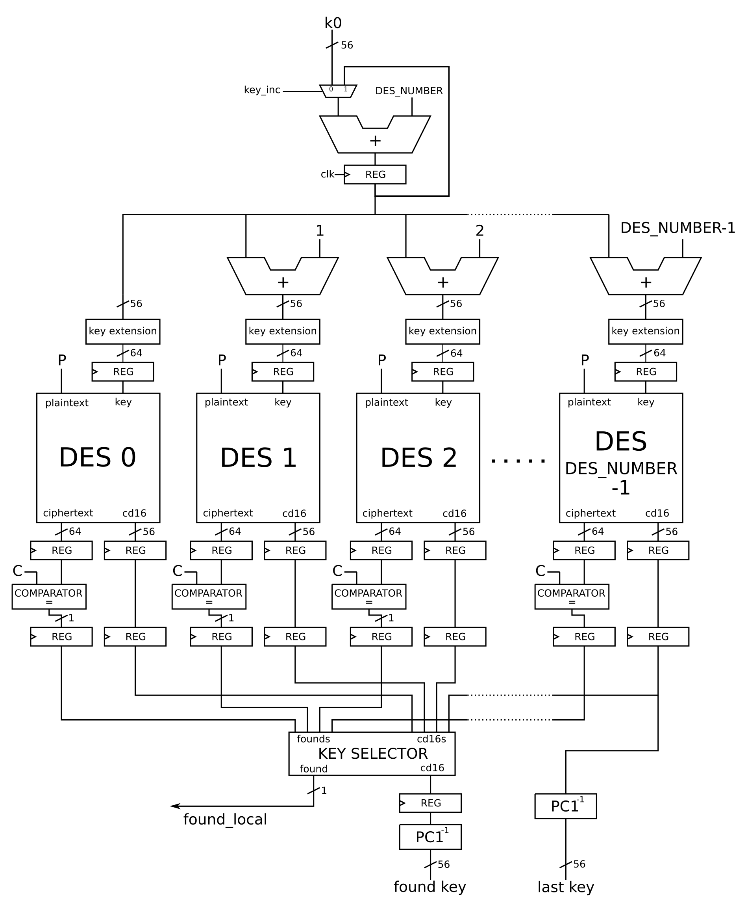
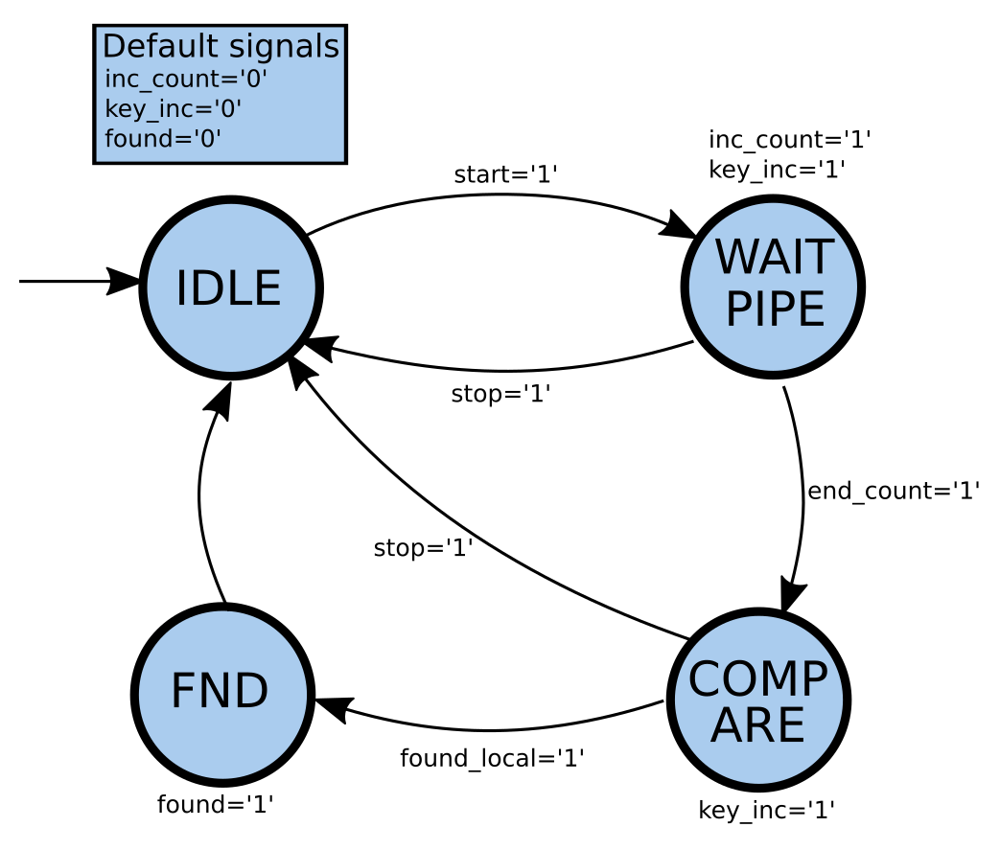
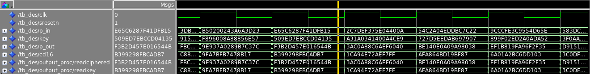
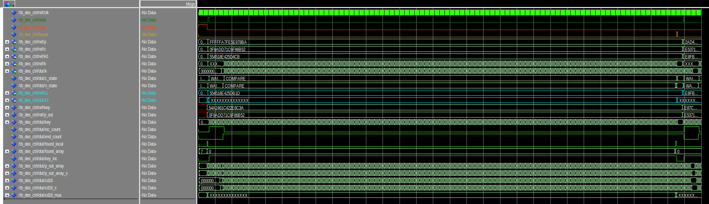
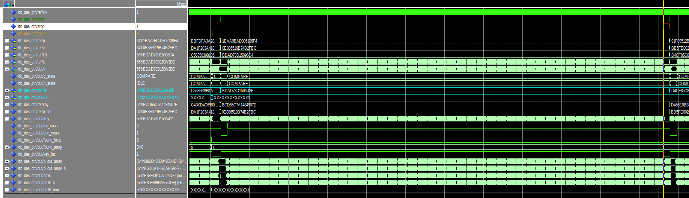
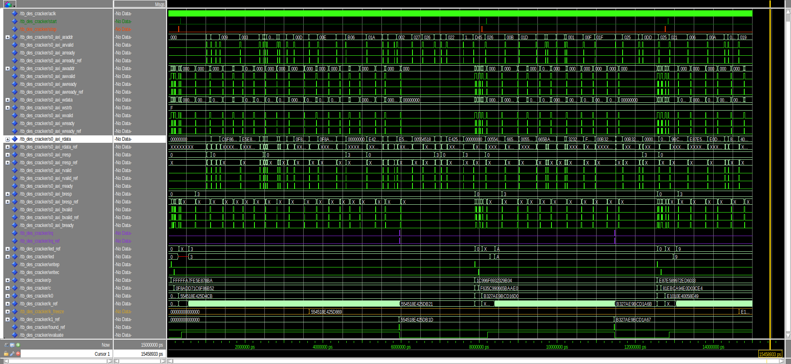
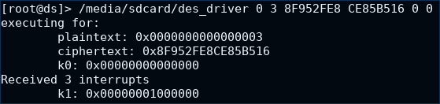

# DES Cracking machine

## Team members:
* Alessandro Tempia Calvino, tempiaa@eurecom.fr
* Pietro Mambelli, mambelli@eurecom.fr

#### Contents:

* [Introduction](#introduction)
* [Source files](#source-files)
* [DES package](#des-packege)
* [Datapath](#datapath)
* [Control](#control)
* [AXI4 lite machinery](#axi4-lite-machinery)
* [Validation](#validation)
* [Synthesis results](#synthesis-results)
* [Linux Driver](#linux-driver)
* [Conclusions](#conclusions)

## Introduction

This project aims at designing and implementing a machine to crack the DES (Data Encryption Standard) encryption algorithm.

Taking into account the constraints of the boards used (Zybo boards) in terms of timing and resource utilization, the idea behind this project is to instantiate as many DES encryption engines as possible and to distribute the computation effort among them.

The cracking machine is given a plaintext $`P`$, a ciphertext $`C`$, 64 bits each, and a 56-bits starting secret key $`K_0`$. It then tries to brute-force all the possible 56-bits keys $`K\ge K_0`$ until the result of the $`P`$ encryption equals $`C`$. When the match is found the cracking machine stores the corresponding secret key $`K_1`$ in a register and raises an interrupt to inform the software stack that runs on the ARM CPU of the Zynq core.

Further specifications are contained inside the [doc] folder.  

Our design involves dividing the solution space into smaller sets of keys. These subsets are addressed to different DES engines that, running in parallel, are in charge of brute-forcing the keys until one of them finds a match between the produced ciphertext and the reference. Every DES instance is given a starting key that is computed as $`K_0`$ plus an offset that depends on the number of DES engines used and the current iteration (more on this in the [Datapath](#datapath) section).

The machine designed is fully pipelined. In particular, the DES block (the one that processes the plaintext with different keys to produce the ciphertext) has been designed with 14 pipeline stages. Considering also the registers inserted along the overall datapath to split the combinatorial delay of the machine, we end up with a total of 18 pipeline stages.

## Source files

In this section the list of all the source code files is reported with a brief description for each of them.

* `des_pkg.vhd`: package file containing the definition of constants, new types and subtypes and all the functions used to implement the DES algorithm
* `reg.vhd`: n-bits register with synchronous reset
* `s_box.vhd`: component that implements a generic S-Box of the DES algorithm (it applies the S-table to 6 bits and outputs the transformed 4 bits)
* `cipher_f.vhd`: component that implements the Feistel $`f`$ function of the DES algorithm
* `f_wrapper.vhd`: wrapper for the *cipher_f* component that takes as inputs the generic $`L`$ and $`R`$ data, applies the f function and the following xor operation to produce the new $`R`$ for the next round
* `key_round.vhd`: component that applies the left-shift and the $`PC_2`$ permutation to the generic $`C`$ and $`D`$ data for the key schedule
* `key_gen.vhd`: block that implements all the key schedule algorithm instantiating a *key_round* component for each of the 16 rounds
* `des.vhd`: block that implements all the DES algorithm taking as inputs the plaintext and the 64-bits key and producing as the ciphertext and the 56-bits permutated key
* `des_wrap.vhd`: wrapper used to produce the input key for the *des* block adding an offset to the starting key depending on the DES number and on the current iteration
* `comparator.vhd`: n-bits comparator with single bit output used to compare the DES output with the ciphertext
* `counter.vhd`: counter component used to wait for the latency due to the pipeline before starting the comparation
* `des_ctrl.vhd`: complete DES engine containing both datapath and state machine for the control
* `des_cracker.vhd`: top-level entity used as wrapper for the *des_ctrl* to implement and manage the AXI4 lite machinery

## DES package
The `des_pkg.vhd` file contains all the functions, signal types and constants needed to implement both the DES algorithm and the rest of our cracker machine's design.

The functions coded in the package are here listed:
* `left_shift`: performs a left shift by *amount*, which can be equal to 1 or 2 depending on the round of the key schedule
* `ip`: performs the initial permutation of the DES algorithm applying the corresponding table to the plain text
* `fp`: performs the inverse of the initial permutation $`IP`$
* `e`: performs the $`E`$ permutation of $`f`$ function applying the corresponding table
* `p`: performs the $`P`$ permutation of $`f`$ function applying the corresponding table
* `pc1`: applies the $`PC_1`$ table of the key schedule algorithm to a 64-bits key and returns a 56-bits key
* `pc1_inv`: reconstructs the 56-bits secrete key from the permutated key (wich is composed of $`C_{16}`$ concatenated with $`D_{16}`$)
* `pc2`: applies the $`PC_1`$ table of the key schedule algorithm to a 56-bits key and returns a 56-bits round key

The new subtypes defined as `wXX` are `std_ulogic_vector` of `XX` bits. They allow us to handle the data as defined in the DES standard (from 1 to `XX`).

In addition to all the constant tables needed to implement the DES algorithm, other two important constant parameters have been defined inside the package:
* `DES_NUMBER`: integer that defines the number of DES block instances in the design
* `PIPE_STAGE`: natural that defines the number of pipeline stages placed along the datapath

## Datapath

This section is dedicated to the explanation of the DES cracker's datapath. The block scheme is shown in the following picture.

Referring to the schematic, the input data are the plaintext $`P`$, the ciphertext $`C`$ (each of them of 64 bits) and the 56-bits starting key `k0`. Starting from `k0`, the new keys must be processed to feed each DES engine at every iteration. First of all, an accumulator (composed by an adder and a register) generates a new key adding `DES_NUMBER` to `k0` at each clock cycle: a mux is placed before it in order to select `k0` as input at the first iteration.

The output key of the accumulator is then sent to each DES instance after being added an offset equal to the engine's index (within 0 to DES_NUMBER-1). For instance, at the first iteration DES_0 receives the key k0, while th generic DES_i receives the key k0+i. At the iteration j, DES_0 receives the key $`k0+j*DES\_NUMBER`$, while the generic DES_i receives the key $`k0+j*DES\_NUMBER+i`$.

Moreover, these 56-bits keys must be extended because the DES blocks take as input a 64-bits key. Note that the bits added in the extension should be parity bits: since they are not used for the purpose of cracking the algorithm, we decided to set them to 0.

The DES engine has been designed according to the common scheme of the algorithm. A pipeline stage is placed between the logic used at each round, except for the initial stage (after the IP permutation) and the final stage (before the FP permutation): the number of stages for each DES block is then 14.

The outputs of every DES engine are:
* the message ciphered with the last tried key
* a 56-bits data called `cd16`.

The latter is extracted from the component used for the round-key generation and it is needed to reconstruct the final solution. In particular, `cd16` is the concatenation of the 32-bits data resulting from the last shift of the key schedule algorithm. Thanks to a proprety of this algorithm, `cd16` is the same 56-bits key generated after the $`PC_1`$ permutation of the 64-bits input key. For this reason, we can apply to it a special function (that could be considered as the inverse of $`PC_1`$, except it directly gets rid of the parity bits) to retrieve the last tried 56-bits key.

Then, the output of each DES (referred in the schematic as *chifertext*) is sent to the corresponding comparator which checks for a match with the given encrypted message $`C`$. When one of the comparators detects a match it rises a signal that is synchronized and kept high for a clock cycle.

The logic hidden inside the *KEY SELECTOR* block consists of:
* an OR gate that takes DES_NUMBER signals, which are the outputs of all the comparators, and produces `found_local`. This signal is used from the control unit to point out that the secret key has been discovered;
* a selector that, taking all the `cd16` signals and the set of outputs from the comparators, chooses the one coming to DES engines that found the secret key. Note that this logic unit has been coded in a behavioral way, in order to leave the implementation and the optimization to the synthesizer.

As already explained, the `cd16` selected is used to reconstruct the 56-bits secret key. A register is placed before the $`PC_1^{-1}`$ block to synchronize that data with the `found` signal produced by the state machine in the control unit. Furthermore, the `cd16` data coming from the last DES machine is used to retrieve the last tried key `k` (through another $`PC_1^{-1}`$ block).

As shown in the schematic, four pipeline stages are placed along the datapath:
* after the accumulator
* after the key extensions
* after the DES blocks
* after the comparators

This choice permits to decrease the critical path delay and increase the clock frequency.  
The throughput of the datapath is of DES_NUMBER-1 keys tried per clock cycle.

## Control
This section explain how the controller manages the machine. The controller ha been implemented in the file [des_ctrl.vhd]. Its entity contains the following signals:

|Name               | Type                             | Direction | Description                                                  |
| :----            | :----                            | :----     | :----                                                         |
| `clk`            | `std_ulogic`                     | in        | clock, the design is synchronized on the rising edge of `clk` |
| `sresetn`        | `std_ulogic`                     | in        | **synchronous** active **low** reset                          |
| `start`          | `std_ulogic`                     | in        | controller start signal                                       |
| `stop`           | `std_ulogic`                     | in        | controller stop signal                                        |
| `p`              | `std_ulogic_vector(63 downto 0)` | in        | the plaintext                                                 |
| `c`              | `std_ulogic_vector(63 downto 0)` | in        | the ciphertext                                                |
| `k0`             | `std_ulogic_vector(55 downto 0)` | in        | the starting key                                              |
| `k`              | `std_ulogic_vector(55 downto 0)` | out       | the current key                                               |
| `k1`             | `std_ulogic_vector(55 downto 0)` | out       | the found secret key                                          |
| `found`          | `std_ulogic`                     | out       | raised when the secret key is found                           |

A Moore state machine has been realized and the state diagram is shown in the following figure.

The machine is composed of four states:
* **IDLE**: this is state where the machine is idle and waits for the start signal to be raised.
* **WAIT_PIPE**: this is the state where the machine begin to search for the keys but the output does not have the right value to compare yet, due to the pipeline latency. A counter is then incremented to count for all the pipeline stages. The output of the `KEY SELECTOR` is ignored. When the counter reaches the pipe stages number, the `end_count` signal is raised and the next state will be the `COMPARE` state.
* **COMPARE**: from here the machine will generate and search the right key waiting for the `found_local` signal to be high.  
* **FND**: this is the final state that is reached when the right key has been found. The `found` signal is raised for a clock cycle and the output contains the cracked key. Then, the machine goes back to the `IDLE` state.

Whenever a `stop` signal is raised, the machine returns to the `IDLE` state.

## AXI4 lite machinery

The cracking machine communicates with the CPU using the AXI4 lite protocol. It is implemented inside the entity [des_cracker.vhd] that contains the following signals:

| Name             | Type                             | Direction | Description                                                                                                            |
| :----            | :----                            | :----     | :----                                                                                                                  |
| `aclk`           | `std_ulogic`                     | in        | master clock from CPU part of Zynq core, the design is synchronized on the rising edge of `aclk`                       |
| `aresetn`        | `std_ulogic`                     | in        | **synchronous** active **low** reset from CPU part of Zynq core (the leading _a_ means AXI, not asynchronous)          |
| `s0_axi_araddr`  | `std_ulogic_vector(11 downto 0)` | in        | read address from CPU (12 bits = 4kB)                                                                                  |
| `s0_axi_arvalid` | `std_ulogic`                     | in        | read address valid from CPU                                                                                            |
| `s0_axi_arready` | `std_ulogic`                     | out       | read address acknowledge to CPU                                                                                        |
| `s0_axi_awaddr`  | `std_ulogic_vector(11 downto 0)` | in        | write address from CPU (12 bits = 4kB)                                                                                 |
| `s0_axi_awvalid` | `std_ulogic`                     | in        | write address valid flag from CPU                                                                                      |
| `s0_axi_awready` | `std_ulogic`                     | out       | write address acknowledge to CPU                                                                                       |
| `s0_axi_wdata`   | `std_ulogic_vector(31 downto 0)` | in        | write data from CPU                                                                                                    |
| `s0_axi_wstrb`   | `std_ulogic_vector(3 downto 0)`  | in        | write byte enables from CPU                                                                                            |
| `s0_axi_wvalid`  | `std_ulogic`                     | in        | write data and byte enables valid from CPU                                                                             |
| `s0_axi_wready`  | `std_ulogic`                     | out       | write data and byte enables acknowledge to CPU                                                                         |
| `s0_axi_rdata`   | `std_ulogic_vector(31 downto 0)` | out       | read data response to CPU                                                                                              |
| `s0_axi_rresp`   | `std_ulogic_vector(1 downto 0)`  | out       | read status response (OKAY, EXOKAY, SLVERR or DECERR) to CPU                                                           |
| `s0_axi_rvalid`  | `std_ulogic`                     | out       | read data and status response valid flag to CPU                                                                        |
| `s0_axi_rready`  | `std_ulogic`                     | in        | read response acknowledge from CPU                                                                                     |
| `s0_axi_bresp`   | `std_ulogic_vector(1 downto 0)`  | out       | write status response (OKAY, EXOKAY, SLVERR or DECERR) to CPU                                                          |
| `s0_axi_bvalid`  | `std_ulogic`                     | out       | write status response valid to CPU                                                                                     |
| `s0_axi_bready`  | `std_ulogic`                     | in        | write response acknowledge from CPU                                                                                    |
| `irq`            | `std_ulogic`                     | out       | interrupt request to CPU                                                                                               |
| `led`            | `std_ulogic_vector(3 downto 0)`  | out       | wired to the four user LEDs                                                                                            |

## Validation

In order to design good simulation environments, we spent a lot of effort trying to cover as most unwanted and critical situations as possible.  
Three test benches have then been developed for the validation of the design:

1. **DES validation**  
The test bench [tb_des] validates the single DES engine [des.vhd]. In order to do this simulation, a Python3 script ([des_encrypt.py]) has been coded for the generation of the inputs and the output references. It creates 100 random plain texts and keys; then, for each pair, it computes the cipher text and it applies the permutation $`PC_1`$ on the key. The two first data are written in a text file named [vector.txt] and are used by the VHDL test bench as inputs of the simulation. Instead, the two computed results are written in the file [expected.txt] and are compared during the simulation with the actual outputs produced by the `des` instance, which are the ciphered message `p_out` and the permutated key `cd16`. After feeding the DES block with the inputs, the process that reads the references must wait 15 clock cycles to ensure the synchronization with the stimulus data: indeed, it must start after the delay due to the pipeline stages. An example of simulation is shown in the following screenshot.

2. **DES controller validation**  
The test bench [tb_des_ctrl] validates the design [des_ctrl.vhd]. The test bench generates random signals, calculates the corresponding DES response (sing a reference implemented inside the test bench and feeds the des controller with the data. In particular, the behavior is the following:
  * Random generation of plain text.
  * Random generation of the starting key $`K_0`$
  * Random generation of the distance $`d`$ between the starting key $`K_0`$ and the secret key $`K1`$
  * Calculation of the secret key as $`K1 = K_0 + d`$
  * Calculation of the cipher text using the reference, starting from the plain text and the secret key
  * Generation of a random delay to start the machine
  * Generation of a random stop delay used to stop the machine before the secret key is found. That happens with a probability of the 20%
  * Calculation of the steps needed by the DES in order to retrieve the secret key. It's calculated as $`n_{iter}=(d - stop) / DES\_NUMBER + 1 + PIPE\_STAGES`$
  * The start signal is given and, at every step, all the signals of the controller are checked with the reference

The random generation tries to cover all the possible combinations of signals and timing events, also at the boundaries.  
In the following image a normal execution of a cracking cycle is shown. The DES controller finds the key when the `found` signal is raised

In the following image, the cracker is stopped before it could find the key. The changing of the state to `IDLE` is notable. The DES is so ready then to start again a cracking cycle.

3. **DES cracker validation**  
The test bench [tb_des_cracker] validates the design [des_cracker.vhd]. It works as the [tb_des_ctrl] described before but translates the reference to communicate with AXI4 protocol and verify every signal and register values through reads and writes. A AXI4 reader and writer has been implemented inside the simulation. More details had to be taken into account so the simulator is pretty complex. With respect to the [tb_des_ctrl] further behaviors are implemented:
  * All the random possibilities of the controller validation are implemented also here
  * AXI4 read testing `OKAY`, `DECERR` and `SLVERR` situations and read data using random addresses
  * AXI4 write testing `OKAY`, `DECERR` and `SLVERR` situations using random addresses
  * AXI4 read and writes are done also testing different response time of `rready` and `bready` in order to test the AXI state machine inside the DES cracker.
  * Start signal is linked to a write to the most significant word of $`k_0`$
  * Stop signal is linked to a write to the least significant word of $`k_0`$
  * The freeze side effect during the read of $`K`$ is tested. In the following simulation image, the signal in gold yellow represents the saved $`K`$ that has been saved in order to test the $`k`$ freeze function.

The following image shows some cracking cycles. A lot of testing reads and writes can be noticed. The start and read signals are not really used but they are useful for a general understanding of how the test is proceeding. The purple signal represents the `irq` that is raised every time that a secret key is found. As written before, the gold signal `k_freeze` saves $`k`$ when its least significant bit is read and resumes when the most significant is read, in order to have the right reference for the $`k`$ AXI reads.

The design has been tested for 200 ms trying more than 40000 random cracking situations.  
To execute the simulation the [des_sim.src] can help to compile the design and to open the right simulation. Also the files [wave_ctrl.do] and [wave_cracker.do], respectively for the controller and cracker validation, can be useful for a good placement and understanding of the waveforms.

## Synthesis results

In order to synthesize the DES cracker for the Zynq core of the Zybo board, we designed a Tcl synthesis script ([des_cracker.syn.tcl]).

The array set of I/Os contains only the four `led` outputs that are mapped to the corresponding pins of the Zybo board. The output for the interrupt request to the CPU is connected to the reserved `IRQ_F2P` pin and configured to use the fabric interrupt of the board.

A variable `frequency_mhz` has been defined in the script to set the clock frequency running on the DES cracker. Note that, since the clock signal is taken directly from the CPU, only a set of discrete frequency values can be used and it is automatically set during the synthesis process.

Since the goal of this project is to optimally use the FPGA resources of the Zync core, the synthesis has been performed for different values of clock frequency and number of DES block instancies until we found the best solution for the design that met the board's contraints. Moreover, some optimization flags have been added in the synthesis script. In particular, the optimization tried by the synthesizer are *opt_design*, *place_design*, *phys_opt_design*, *route_design*, *phys_opt_design*, all of them with an "Explore" directive. Thanks to these optimization we can achieve some improvments in terms of performances.

From the synthesis reports it is possible to analyze the results obtained with the various solutions. In particular, from the timing report we can see which is the clock frequency synthesized and check which is the critical path of our design. The maximum speed for which the design can meet all the timing constraints is reached with a frequency equal to 200 MHz, that corresponds to a clock period of 5 ns. The critical path is not inside the designed datapath but in the AXI4 protocol machinery. This maximum delay path produces a slack of 0.013 ns, which is the difference between the required time and the arrival time to reach the last cell of the path.

Regarding the area constraints we can refer to the utilization report generated by the synthesis. The solution that uses the highest number of FPGA's slices consists on instantiating 10 DES blocks (specified in the code by the `DES_NUMBER` parameter). In this case the percentage of Slice LUTs used in the Zynq core is 88.77% and most of them are used for the logic. The Slice registers used as Flip-Flops are 20781 (corresponding to 59.04%) and are mainly due to the pipeline stages.

The results just described are summarized in the following table.

| Timing                   | Result                             |  
| :----                    | :----                              |  
| Clock frequency [MHz]    | 200                                |  
| Clock period [ns]        | 5.000                              |  
| Slack [ns]               | 0.013                              |  

| Utilization              | Result                             |  
| :----                    | :----                              |  
| DES instances            | 10                                 |  
| Slice LUTs               | 88.77 %                            |  
| Flip-Flops               | 59.04 %                            |  

Since the DES cracker tries 10 keys per clock cycle, and considering the maximum clock frequency achieved with the synthesis, the final throughput of tried keys per second is equal to `2 billions`.  

## Linux Driver

The linux driver to run the cracking machine is contained in the file [des_driver.c]. The resulting software takes as arguments the plain text, the cipher text and the starting key. When the `k1` has been found, it prints the result key. More in details, it performs the following actions:
* open the device file
* map the device file in a shared memory region
* enable the interrupts
* write plaintext, ciphertext and `k0` in the mapped registers (32 bits per register)
* wait for interrupt with a blocking read
* print the number of interrupts received
* read from the mapped registers the 2 words of the found key `k1`
* print the found key `k1`

One example of execution is shown in the screenshot below. In this execution the program takes as inputs:
* the plaintext `0x0000000000000003`
* the ciphertext `0x8F952FE8CE85B516`
* startin key `k0` equal to zero

and prints the number of interrupts that is 3, together with the found key that is `0x00000001000000`.

## Conclusions

Considering the worst case scenario, this implementation will find the correct key in at most 417 days. Having 45 Zybo boards working in parallel with different starting keys, the DES algorithm will be cracked in about 9 days. This result can be compared to the performances achieved in 1999 by the "Deep Crack" with a budget of $200,000 or with 1000 recent high end PCs.

Note that design has been optimized for the `Zybo` board where there is space only for 10 DES machines. In case of bigger FPGAs the design should be changed a bit. One reason could be related to the `KEY SELECTOR` operation, which could become really slow if performed with a large number inputs. In this case, the best solution is to revise that operation into a pipelined tree structure: since in theory the selection is composed of multiplexers, this change should be very easy. The second reason could be the presence of buffers placed during the synthesis in order to deliver the same signal to a lot of resources: this overhead could affect the timing performances. In this case, a timing analysis is required and, if necessary, one can decide to replicate some hardware in order to get rid of those buffers.

[doc]:                  doc/
[tb_des_ctrl]:          vhdl/sim/tb_des_ctrl.vhd
[des_ctrl.vhd]:         vhdl/sim/des_ctrl.vhd
[tb_des_cracker]:       vhdl/sim/tb_des_cracker.vhd
[des_cracker.vhd]:      vhdl/sim/tb_des_cracker.vhd
[tb_des]:               vhdl/sim/tb_des.vhd
[des.vhd]:              vhdl/sim/des.vhd
[des_encrypt.py]:       vhdl/sim/tb_des_reference/des_encrypt.py
[vector.txt]:           vhdl/sim/tb_des_reference/vector.txt
[expected.txt]:         vhdl/sim/tb_des_reference/expetced.txt
[des_sim.src]:          vhdl/sim/des_sim.src
[wave_ctrl.do]:         vhdl/sim/wave_ctrl.do
[wave_cracker.do]:      vhdl/sim/wave_cracker.do
[des_cracker.syn.tcl]:  vhdl/syn/des_cracker.syn.tcl
[timing report]:        vhdl/syn/reports/des_cracker.timing.rpt
[utilization report]:   vhdl/syn/reports/des_cracker.utilization.rpt
[des_driver.c]:         driver/des_driver.c
