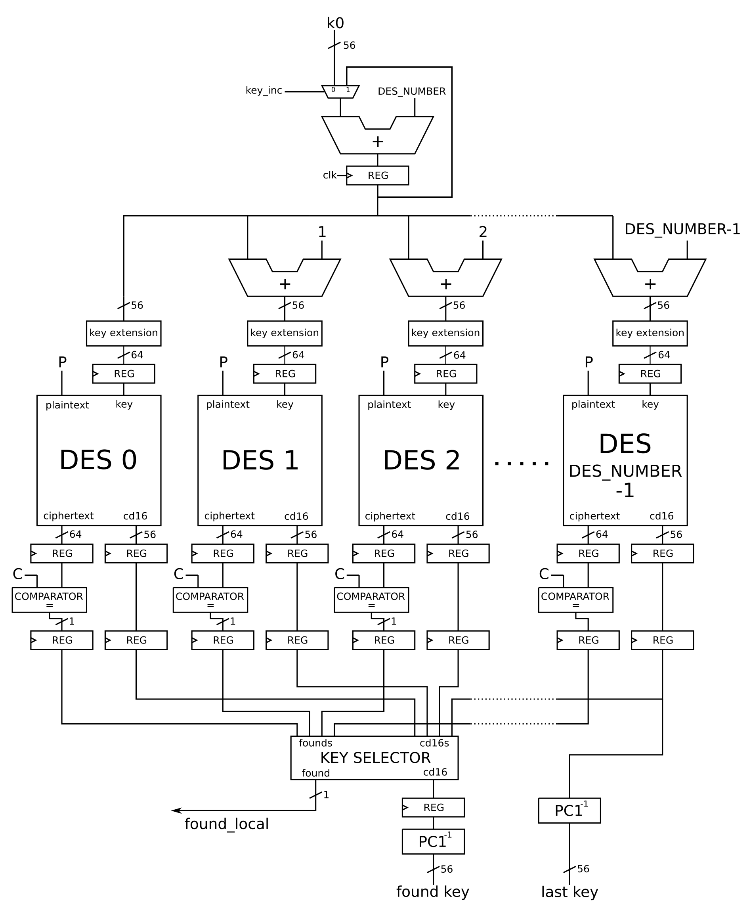

# Hardware DES cracker - REPORT

#### Authors: Pietro Mambelli, Alessandro Tempia Calvino

#### Contents:

* [Introduction](#introduction)
* [Source files](#source-files)
* [Datapath](#datapath)
* [Control](#control)
* [AXI4 lite machinery](#axi4-lite-machinery)
* [Validation](#validation)
* [Synthesis results](#synthesis-results)

## Introduction

This project aims at designing and implementing a machine to crack the DES (Data Encryption Standard) encryption algorithm.

Taking into account the contraints of the boards used (Zybo boards) in terms of timing and resource utilization, the idea behind this project is to instantiate as many DES encryption engines as possible and to distribute the computation effort among them.

The cracking machine is given a plaintext $`P`$, a ciphertext $`C`$, 64 bits each, and a 56-bits starting secret key $`K_0`$. It then try to brute-force all the possible 56-bits keys $`K\ge K_0`$ until the result of the $`P`$ encryption equals $`C`$. When the match have been found the cracking machine stores the corresponding secret key $`K_1`$ in a register and raises an interrupt to inform the software stack that runs on the ARM CPU of the Zynq core.

All the detailed specifications for this project can be found in the [README.md](./README.md) file.

Our design involves dividing the solution space into smaller sets of keys. These subsets are addressed to different DES engines that, running in parallel, are in charge of brute-forcing the keys until one of them find the correct solution. Every DES instance is given a starting key computed as $`K_0`$ plus an offset that depends on the number of DES engines used and the current iteration.

The machine designed is fully pipelined. In particular, the DES block (that processes the plaintext with different keys to produce the ciphertext) has been designed with 14 pipeline stages. Considering also the registers inserted in the overall datapath to split the combinatorial delay of the machine, we end up with a total of 18 pipeline stages.

## Source files

In this section the list of all the source code files is reported with a brief description for each of them.

* `des_pkg.vhd`: package file containing the definition of constants, new types and subtypes and all the functions used to implement the DES algorithm
* `reg.vhd`: n-bits register with synchronous reset
* `s_box.vhd`: component that implements a generic S box of the DES algorithm (it applies the S table to six bits and outputs the transformed 4 bits)
* `cipher_f.vhd`: component that implements the Feistel f function of the DES algorithm
* `f_wrapper.vhd`: wrapper for the *cipher_f* component that takes as inputs the generic $`L`$ and $`R`$ data, applies the f function and the following xor operation to produce the new $`R`$ for the next round
* `key_round.vhd`: component that applies the left-shift and the $`PC_2`$ permutation to the generic $`C`$ and $`D`$ data for the key schedule
* `key_gen.vhd`: block that implements all the key schedule algorithm instantiating a *key_round* component for each of the 16 rounds
* `des.vhd`: block that implements all the DES algorithm taking as inputs the plaintext and the 64-bits key and producing as the ciphertext and the 56-bits permutated key
* `des_wrap.vhd`: wrapper used to produce the input key for the *des* block adding an offset to the starting key depending on the DES number and on the current iteration
* `comparator.vhd`: n-bits comparator with single bit output used to compare the DES output with the ciphertext
* `counter.vhd`: counter component used to wait for the latency due to the pipeline before starting the comparation
* `des_ctrl.vhd`: complete DES engine containing both datapath and state machine for the control
* `des_cracker.vhd`: top-level entity used as wrapper for the *des_ctrl* to implement and manage the AXI4 lite machinery

## Datapath

This section is dedicated to the explanation of the DES cracker's datapath. The block scheme is shown in the following picture.

Referring to the schematic, the input data are the plaintext $`P`$, the ciphertext $`C`$ (each of them of 64 bits) and the 56-bits starting key `k0`. Starting from `k0`, the new keys must be processed to feed each DES engine at every iteration. First of all, an accumulator (composed by an adder and a register) generates a new key adding `DES_NUMBER` to `k0` at each clock cycle: a mux is placed before it in order to select `k0` as input at the first iteration.

The output key of the accumulator is then sent to each DES instance after being added an offset equal to the engine's index (within 0 to DES_NUMBER-1). Moreover, these 56-bits keys must be extended because the generic DES block takes as input a 64-bits key. Note that the bits added in the extension should be parity bits: since they are not used for the purpose of cracking the algorithm, they are set to 0.

The DES engine has been designed according to the common scheme of the algorithm. A pipeline stage is placed between the logic used at each round, except for the initial stage (after the IP permutation) and the final stage (before the $`FP`$ permutation).

The outputs of every DES engine are:
* the message ciphered with the last tried key
* a 56-bits data called `cd16`.

The latter is extracted from the component used for the round-key generation and it is needed to reconstruct the final solution. In particular, `cd16` is the concatenation of the 32-bits data resulting from the last shift of the key schedule algorithm. Thanks to a proprety of this algorithm, `cd16` is the same 56-bits key generated after the $`PC_1`$ permutation of the 64-bits input key. For this reason, we can apply to it a special function (that could be considered as the inverse of $`PC_1`$, except it directly gets rid of the parity bits) to retrieve the last tried 56-bits key.

Then, the output of each DES (referred in the schematic as *chifertext*) is sent to the corresponding comparator which checks for a match with the given encrypted message $`C`$. When one of the comparators detects a match it rises a signal that is synchronized and kept high for a clock cycle.

The logic hidden inside the *KEY SELECTOR* block consists of:
* an OR gate that takes DES_NUMBER signals, which are the outputs of all the comparators, and produces `found_local`. This signal is used from the control unit to point out that the secret key has been discovered;
* a selector that, taking all the `cd16` signals and the set of outputs from the comparators, chooses the one coming to DES engines that found the secret key. Note that this logic unit has been coded in a behavioral way, in order to leave the implementation and the optimization to the synthesizer.

As already explained, the `cd16` selected is used to reconstruct the 56-bits secret key. A register is placed before the $`PC_1^-1`$ block to synchronize that data with the `found` signal produced by the state machine in the control unit. Furthermore, the `cd16` data coming from the last DES machine is used to retrieve the last tried key `k` (through another $`PC_1^-1`$ block).

As shown in the schematic, four pipeline stages are placed among the datapath:
* after the accumulator
* after the key extensions
* after the DES blocks
* after the comparators
This choice permits to decrease the critical path delay and increase the clock frequency.

## Control

## AXI4 lite machinery

The cracking machine communicates with the CPU using the AXI4 lite protocol.

## Validation

## Synthesis results

In order to synthesize the DES cracker for the Zynq core of the Zybo board, we designed a Tcl synthesis script.

The array set of I/Os contains only the four `led` outputs that are mapped to the corresponding pins of the Zybo board. The output for the interrupt request to the CPU is connected to the reserved `IRQ_F2P` pin and configured to use the fabric interrupt of the board.

A variable `frequency_mhz` has been defined in the script to set the clock frequency running on the DES cracker. Note that, since the clock signal is taken directly from the CPU, only a set of discrete frequency values can be used and it is automatically set during the synthesis process.

Since the goal of this project is to optimally use the FPGA resources of the Zync core, the synthesis has been performed for different values of clock frequency and number of DES block instancies until we found the best solution for the design that met the board's contraints.

From the synthesis reports it is possible to analyze the results obtained with the various solutions. In particular, from the timing report we can see which is the clock frequency synthesized and check which is the critical path of our design. The maximum speed for which the design can meet all the timing constraints is reached with a frequency equal to 187.512 MHz, that corresponds to a clock period of 5.333 ns. The critical path is inside the `des_ctrl`: it starts from the generic register that is placed right after the DES block and passes firstly through the comparator and then through the combinatorial logic used for the key selection. This maximum delay path produces a slack of 0.007 ns, which is the difference between the required time and the arrival time to reach the last cell of the path.

Regarding the area constraints we can refer to the utilization report generated by the synthesis. The solution that uses the highest number of FPGA's slices consists on instantiating 12 DES blocks (specified in the code by the `DES_NUMBER` parameter). In this case the percentage of Slice LUTs used in the Zynq core is 92.30% and most of them are used for the logic. The Slice registers used as Flip-Flops are 18535 (corresponding to 52.66%) and are mainly due to the pipeline stages.
